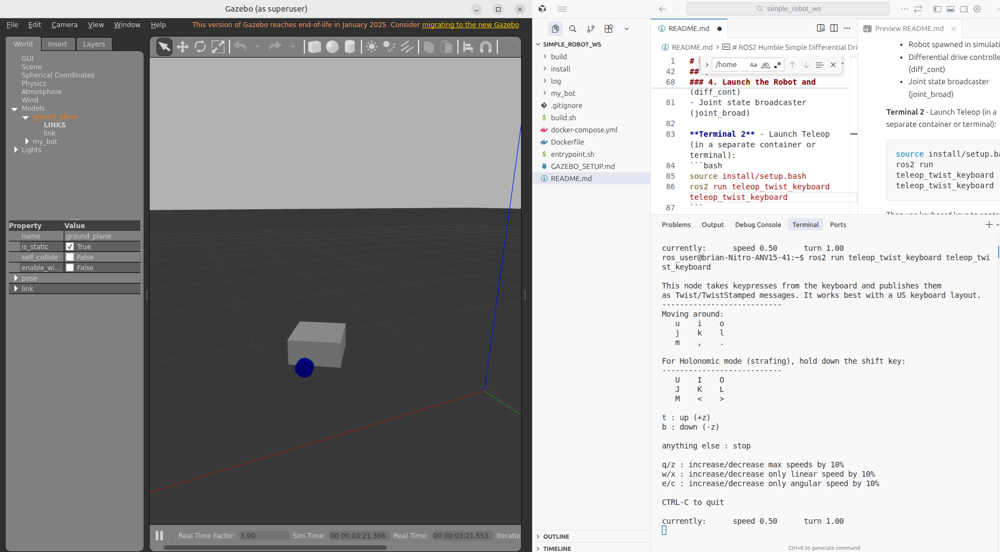

# ROS2 Humble Simple Differential Drive Robot

This project sets up a ROS2 Humble environment with Gazebo Classic and implements a simple differential drive robot with two driven wheels and a caster wheel.

Note: this robot will not drive correctly on first launch, the parameters will need to be tuned for good performance.


## Project Structure

```
simple_robot_ws/
├── Dockerfile                 # Docker image definition
├── docker-compose.yml        # Docker Compose configuration
├── build.sh                  # Build script
├── my_bot/                   # ROS2 package directory
│   ├── my_bot/
│   │   ├── launch/
│   │   │   ├── launch_sim.launch.py      # Main simulation launch file
│   │   │   ├── rsp.launch.py             # Robot state publisher launch file
│   │   │   ├── gazebo_only.launch.py     # Deprecated (empty)
│   │   │   └── launch_robot.launch.py    # Real robot launch file
│   │   ├── description/
│   │   │   ├── robot.urdf.xacro         # Main URDF file
│   │   │   ├── robot_core.xacro         # Robot structure (links and joints)
│   │   │   ├── gazebo_control.xacro     # Gazebo plugins and physics
│   │   │   └── inertial_macros.xacro    # Inertia calculation macros
│   │   ├── config/
│   │   │   ├── gazebo_params.yaml        # Gazebo parameters
│   │   │   ├── my_controllers.yaml       # ROS2 control configuration
│   │   │   └── twist_mux.yaml           # Command velocity multiplexing
│   │   ├── worlds/
│   │   │   └── empty_world.world         # Gazebo world file
│   │   ├── CMakeLists.txt
│   │   └── package.xml
```

## Prerequisites

- Docker and Docker Compose installed
- X11 display server (for GUI applications like RViz and Gazebo)
- Linux system (tested on Ubuntu)

## Quick Start

### 1. Build the Docker Image

```bash
cd /<workspace>/simple_robot_ws
docker compose build
```

### 2. Start the Container

```bash
docker compose up -d
docker compose exec ros2_humble bash
```

### 3. Build the Workspace

Inside the container:

```bash
cd workspace
colcon build --symlink-install
source install/setup.bash
```

### 4. Launch the Robot and Simulation

**Terminal 1** - Launch Gazebo simulation with robot:
```bash
source install/setup.bash
ros2 launch my_bot launch_sim.launch.py
```

This will start:
- Robot state publisher (publishes transforms)
- Gazebo server and client
- Robot spawned in simulation
- Differential drive controller (diff_cont)
- Joint state broadcaster (joint_broad)

**Terminal 2** - Launch Teleop (in a separate container or terminal):
```bash
source install/setup.bash
ros2 run teleop_twist_keyboard teleop_twist_keyboard
```

Then use keyboard keys to control the robot:
- `i` - forward
- `,` - backward  
- `j` / `l` - rotate left/right
- `k` - stop
- `q` to quit

The robot will move in Gazebo based on your keyboard commands.



## Robot Description

The simple differential drive robot includes:

- **base_link**: Main coordinate frame at the wheel axis center
- **chassis**: Main body (0.3 x 0.3 x 0.15 m white box)
- **left_wheel**: Left drive wheel (continuous joint, blue cylinder)
- **right_wheel**: Right drive wheel (continuous joint, blue cylinder)
- **caster_wheel**: Front caster for stability (fixed joint, black sphere)

### Coordinate System (ROS Standards)
- X-axis: Forward
- Y-axis: Left
- Z-axis: Up

## Building and Modifying

When modifying URDF files:
1. Changes are automatically reflected due to `--symlink-install`
2. **Exception**: Adding new files requires a rebuild
3. Restart `robot_state_publisher` after changes
4. Click **Reset** in RViz if visualizations don't update

## Useful Commands

```bash
# Check robot description
ros2 param get /robot_state_publisher robot_description | head -20

# List active topics
ros2 topic list

# Inspect joint states
ros2 topic echo /joint_states

# View transform tree
ros2 run tf2_tools view_frames.py
```

## Next Steps

To extend the robot:
1. Add sensors (camera, lidar, IMU) to `robot_core.xacro`
2. Implement custom control nodes
3. Add path planning and navigation
4. Integrate SLAM for autonomous mapping

## Troubleshooting

### Spawner executable errors
If you see errors like `executable 'spawner.py' not found`, use `spawner` (without `.py`) as the executable name. This is the correct entry point in ROS2 Humble.

### Multiple robots spawning
The `spawn_entity.py` node should be the only robot spawner. Ensure it's the only entity spawn call in the launch file.

### Controller manager not responding
The spawner nodes wait for `/controller_manager/list_controllers` service. Ensure `ros2_control_node` and the controller manager are properly started before spawners run.

## References

- [ROS Coordinate Frames (REP 105)](https://ros.org/reps/rep0105.html)
- [Standard Units and Conventions (REP 103)](https://ros.org/reps/rep0103.html)
- [ROS2 URDF Documentation](https://wiki.ros.org/urdf)
- [ROS2 Humble Documentation](https://docs.ros.org/en/humble/)
